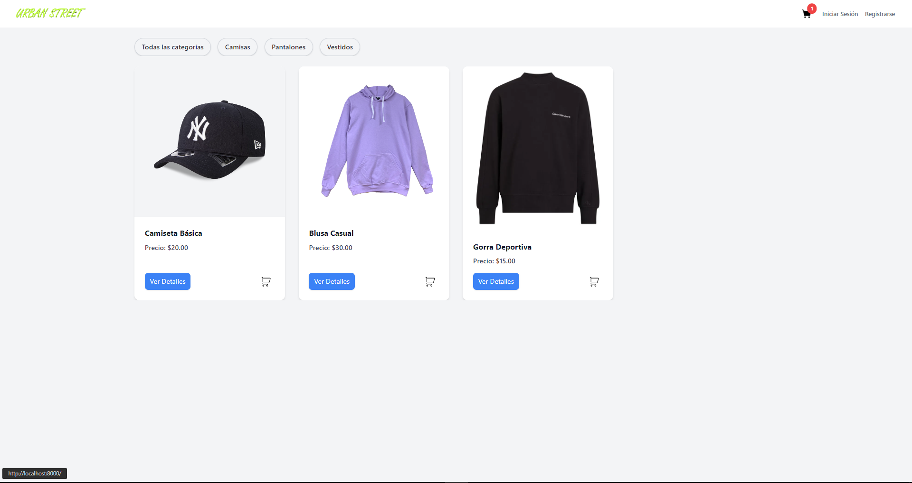
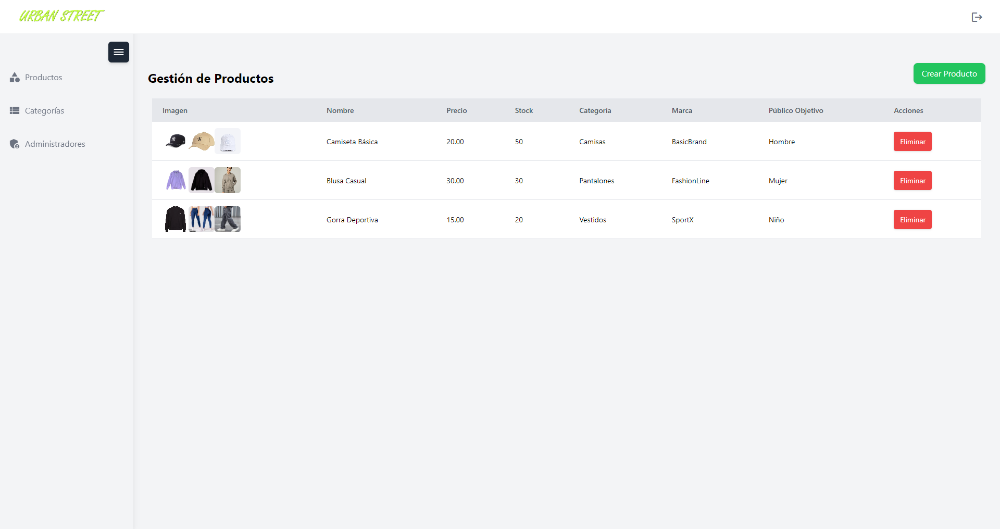

# Ecommerce Laravel 8
Este es un proyecto de ecommerce (tienda virtual) para la venta de ropa, desarrollado en **Laravel** 8 y con base de datos en MySQL. El proyecto está dockerizado para facilitar su desarrollo y **despliegue**, y cuenta con un flujo de trabajo automatizado utilizando **GitHub Actions** para desplegar la aplicación en una instancia EC2 de **AWS**.

## Tabla de Contenidos
- [Requisitos](#requisitos)
- [Instalación sin Docker](#instalacion-sin-docker)
- [Instalación con Docker](#instalacion-con-docker)
- [Despliegue en AWS](#despliegue-en-aws)
- [Contribuciones](#contribuciones)

- ### Admin Panel


- ### Vista Home


## Requisitos
Antes de comenzar, asegúrate de tener instalados los siguientes programas:

- Docker
- Docker Compose
- MySQL
- Node
- Git
- En lo posible usar WSL si usa Windows
- PHP 7.4 (Si haras la instalacion sin Docker)

## Instalación sin Docker

### 1. Clonar el repositorio:

```bash
git clone https://github.com/tjhoan/projectDesarrollo.git
cd projectDesarrollo
```

### 2. Instalación de Dependencias 
```bash
npm install && composer install
```

### 3. Generando clave
```bash
php artisan key:generate
```

### 4. Configuración del archivo .env
Renombra el archivo .env.docker a .env y configura tu base de datos.
Además, crea una base de datos llamada laravel en MySQL.

Luego, abre el archivo .env y asegúrate de que las siguientes configuraciones estén correctas:

```bash
DB_CONNECTION=mysql
DB_HOST=127.0.0.1
DB_PORT=3306
DB_DATABASE=laravel
DB_USERNAME=tu_usuario
DB_PASSWORD=tu_contraseña
```

### 5. Ejecutar migraciones y seeders
```bash
php artisan migrate:fresh --seed --force
```

### 6. Ejecutar laravel
```bash
php artisan serve
```

### 7. Acceder a la aplicación en su navegador

Puedes acceder a la tienda virtual a través de tu navegador en:

http://localhost:8000

## Instalación con Docker

### 1. Clonar el repositorio:

```bash
git clone https://github.com/tjhoan/projectDesarrollo.git
cd projectDesarrollo
```

> [!IMPORTANT] 
> Asegúrate de tener Docker y Docker Compose instalados antes de proceder.

## 2. Ejecutar el script init.sh:

> [!CAUTION]
> El comando init.sh eliminará todos los contenedores, imágenes, volúmenes y redes en tú PC. 
> Esto incluye la ejecución de los siguientes comandos:

```bash
docker-compose down -v
docker system prune -a --volumes -f
```
Este proceso es irreversible y puede causar la pérdida de datos no guardados. Asegúrate de hacer una copia de seguridad de cualquier dato importante antes de proceder o puedes eliminar estas lineas del archivo antes de ejecutarlo.

Una vez dentro del directorio del proyecto, simplemente ejecuta el siguiente comando para iniciar la construcción de los contenedores, configurar el entorno y levantar la aplicación:

```bash
chmod +x init.sh #asignar permisos
./init.sh
```

[!NOTE] Los comandos proporcionados están destinados a sistemas Linux.

### Este script realiza automáticamente las siguientes acciones:

1. Ajusta los permisos y propiedad de los archivos.
2. Configura el archivo .env.
3. Detiene y elimina contenedores y volúmenes previos si existen.
4. Construye y levanta los contenedores de Docker.
5. Espera a que la base de datos esté lista y ejecuta las migraciones.

> [!NOTE] 
> El script `init.sh` está diseñado para simplificar la instalación, por lo que no es necesario realizar pasos adicionales manualmente. Si no puedes ejecutar el script, puedes realizar los pasos manualmente que están detallados dentro del archivo `init.sh`.

## Acceder a la aplicación:

Una vez que los contenedores estén levantados, puedes acceder a la tienda virtual a través de tu navegador en:

http://localhost

## Despliegue en AWS
Este proyecto utiliza GitHub Actions para automatizar el despliegue de la aplicación en una instancia EC2 de AWS.

### Flujo de trabajo en GitHub Actions
Cada vez que se realiza un push a la rama master, el flujo de trabajo se ejecuta automáticamente, realizando los siguientes pasos:

1. Se conecta a la instancia EC2 mediante SSH.
2. Instala Docker y Docker Compose si no están instalados.
3. Clona o actualiza el repositorio en la instancia EC2.
4. Ejecuta el script init.sh para configurar el entorno, construir los contenedores y levantar la aplicación.

Si desea acceder a la tienda virtual visite:
http://54.242.158.3

## Tecnologías Usadas

-  
-  
-  
- 
- 

## Contribuciones
Si deseas contribuir a este proyecto, sigue estos pasos:

- Haz un fork de este repositorio.
- Crea una nueva rama (git checkout -b feature-nombre).
- Realiza tus cambios y haz commit (git commit -am 'Añadir nueva característica').
- Envía tu rama (git push origin feature-nombre).
- Abre un Pull Request.